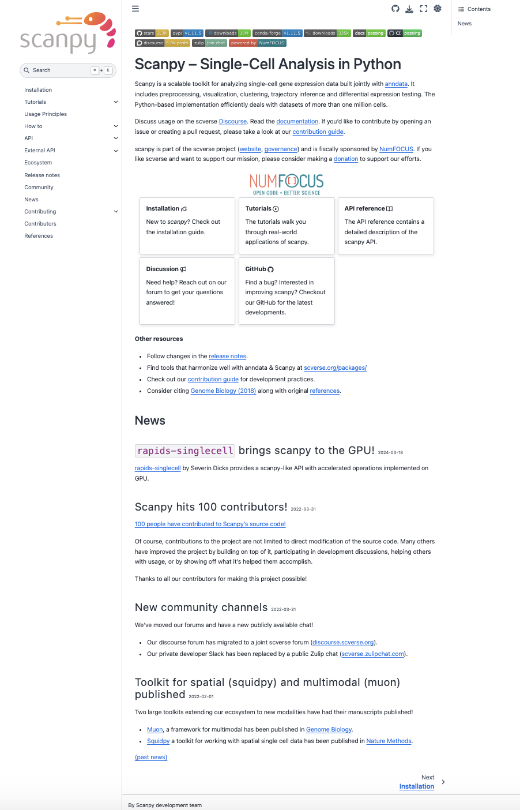

# Scanpy Landing Page
How can the landing page of scanpy's documentation be improved to give user's of any background a better user experience?

  

---

## Table of contents
- [Overview](#overview)
- [CurrentLayout](#currentlayout)
- [Painpoints](#painpoints)
- [Methods](#methods)
- [Results](#results)
- [Discussion](#discussion)
- [Recommendations](#recommendations)
- [Appendix](#appendix)
- [Contacts](#contacts)

---

## Overview
Scanpy, one of the most widely used python ecosystems for single-cell workflows, offers robust tutorials that walk users from raw matrices to embeddings, clustering, and downstream interpretation. The landing page is the first point of contact for someone who is learning how to interact with this ecosystem. However its current structure is not friendly to all users. 

In this project I wanted  to analyze the current landing page experience and identify where the UX could better support users.

This case study focuses on:

- What users need

- Where the current experience falls short

- Opportunities to make the tutorial landing page more navigable, approachable, and “learnable.”

---

## CurrentLayout

---

## Painpoints
| Pain Points | Why It Was a Problem | Design Improvement | Impact / Result |
|:---|:---|:---|:---|
|No clear CTA (call to action) | Users don’t know what to do next (install? try tutorial? read docs?) | Added primary buttons for “Install”, “Try a Tutorial”, “Explore Docs” | Creates a guided first step and improves conversions into the ecosystem
| Hard-to-find beginner guidance | New users don’t know where to start; often jump into advanced docs | Added a “Start Here” pathway with Quickstart + Beginner Tutorials | Improves onboarding and reduces bounce rate for new users |
Dense, text-heavy homepage | Users can’t quickly understand what Scanpy does or who it’s for | Introduced a simplified hero section with a crisp value statement and visual hierarchy | Users immediately understand the tool and can self-identify relevance |
| More Developer Friendly | Scanpy is used by researchers of all coding experiences, this developer tutorial friendly framework does not make it accessible to others as much | | |

---

## Analysis

---

## Conclusion

